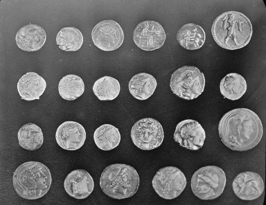
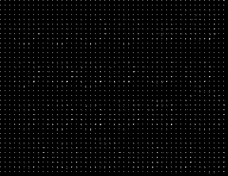
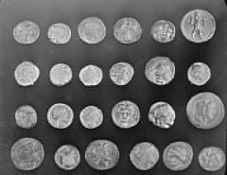

# DCT-Image-Compression
Uses Discrete Cosine Transform or DCT to transform the image from spatial domain to frequency domain. Through this transform we can also eliminate low frequency data which helps reduce with size of image. This is a lossy method of compression.

The code only supports grayscale image.

Drawbacks of the code
* Time Consuming
* Contains 4 level for loops even with grayscale image

Assosciated topics
* FFT
* DFT
* DWT
* DCT
* DCTMAX
* DCT2

# Input File

# Intermediate File

Intermediate Image is a representation of input image in Frequency Domain. At this stage we can remove low frequent data using appropriate filters to reduce image size.
Eg: Consider 2x2 Filter
    [[1., 1.],
     [1., 1.]] => No compression, all data is preserved
    [[1., 1.],
     [1., 0.]] => Last Data from the filter is eliminated
# Output File

Output image is obtained by performing inverse DCT on Intermediate image, this operation converts image from frequency domain back to spatial domain.
